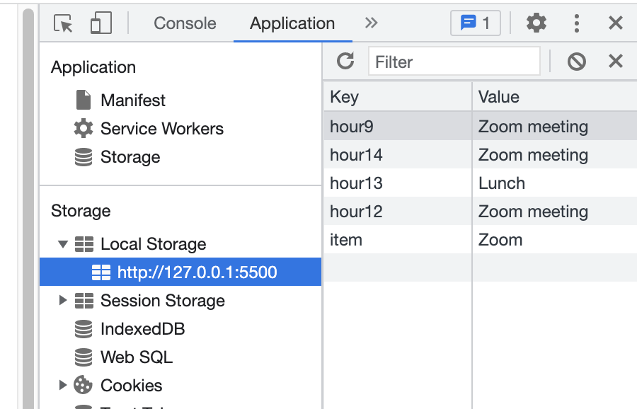

# Third-Party APIs: Work Day Scheduler

## Your Task

Create a simple calendar application that allows a user to save events for each hour of the day by modifying starter code. This app will run in the browser and feature dynamically updated HTML and CSS powered by jQuery.

You'll need to use the [Moment.js](https://momentjs.com/) library to work with date and time. Be sure to read the documentation carefully and concentrate on using Moment.js in the browser.

## User Story

```md
AS AN employee with a busy schedule
I WANT to add important events to a daily planner
SO THAT I can manage my time effectively
```
 
## Acceptance Criteria

The app should:

* Display the current day at the top of the calender when a user opens the planner.
 
* Present timeblocks for standard business hours when the user scrolls down.
 
* Color-code each timeblock based on past, present, and future when the timeblock is viewed.
 
* Allow a user to enter an event when they click a timeblock

* Save the event in local storage when the save button is clicked in that timeblock.

* Persist events between refreshes of a page

The following animation demonstrates the application functionality:


## What i learned from this project:

I firstly added the current date to the header of the HTML page. This was complete using moment.js. I had to make sure moment.js documentation was incremented into by HTML file so that the JS file would work correctly. 


I ensured that when entering the events into the schedule that they saved to when a user exits the schedule it will save to local storage as you can see in the screen shot below. 





### GitHub
https://github.com/bex-ford/module-7

---